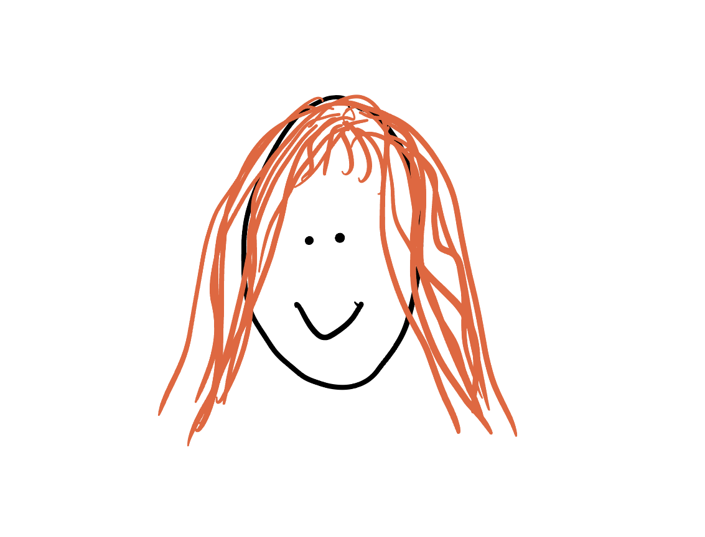
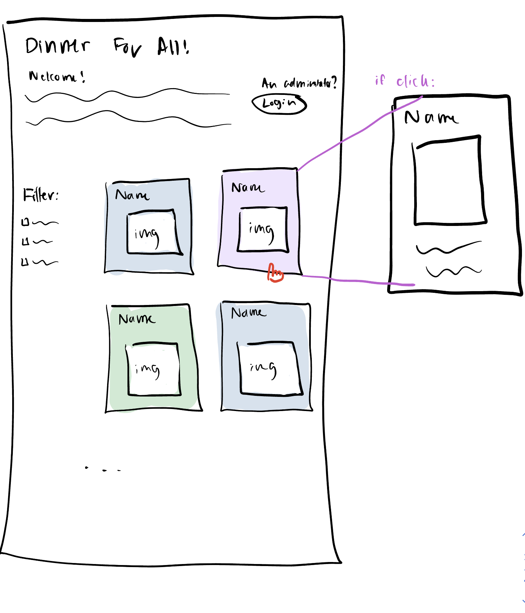
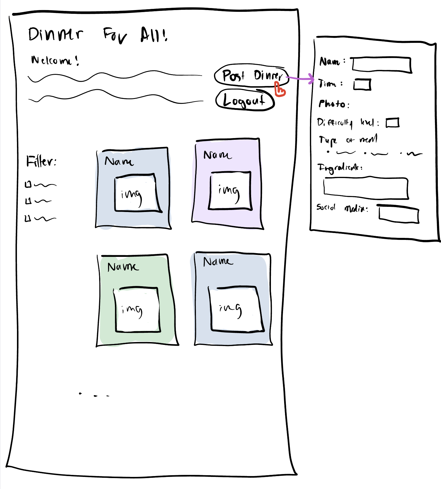
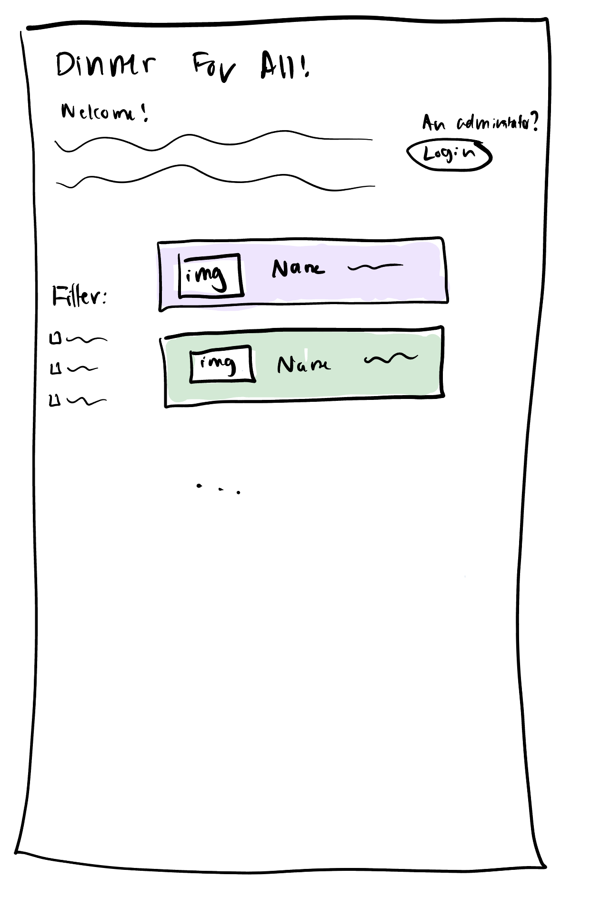

# Project 3: Design Journey

**For each milestone, complete only the sections that are labeled with that milestone.** Refine all sections before the final submission.

You are graded on your design process. If you later need to update your plan, **do not delete the original plan, rather leave it in place and append your new plan _below_ the original.** Then explain why you are changing your plan. Any time you update your plan, you're documenting your design process!

**Replace ALL _TODOs_ with your work.** (There should be no TODOs in the final submission.)

Be clear and concise in your writing. Bullets points are encouraged.

**Everything, including images, must be visible in _Markdown: Open Preview_.** If it's not visible in the Markdown preview, then we can't grade it. We also can't give you partial credit either. **Please make sure your design journey should is easy to read for the grader;** in Markdown preview the question _and_ answer should have a blank line between them.

## Design Plan (Milestone 1)

**Make the case for your decisions using concepts from class, as well as other design principles, theories, examples, and cases from outside of class (includes the design prerequisite for this course).**

You can use bullet points and lists, or full paragraphs, or a combo, whichever is appropriate. The writing should be solid draft quality.

### Catalog (Milestone 1)
> What will your catalog website be about? (1 sentence)

My catagog will be a social-media inspired blog where people can post photos and information on dinners they eat.

### _Consumer_ Audience (Milestone 1)
> Briefly explain your site's _consumer_ audience. Your audience should be specific, but not arbitrarily specific. (1 sentence)
> Justify why this audience is a **cohesive** group. (1-2 sentences)
>
Consumer audience: people who are unsatsifed with their current dinner habits because of their lack of knowledge, and use the site to get dinner inspiration.

This is a cohesive audience because they are all motivated by the same common interest, which is to get inspired by others' meal choices and change their habits as a result. People in this audience are those who are not satisfied with their dinner habits, whether that be the time they eat, the quality of food, the amount if food, etc. They all use the site to see what other people post for dinner to copy those meals, or make somehting similar, to create better habitws and live a healthier lifestyle

### _Consumer_ Audience Goals (Milestone 1)
> Document your _consumer_ audience's goals for using this catalog website.
> List each goal below. There is no specific number of goals required for this, but you need enough to do the job (Hint: It's more than 1. But probably not more than 3.)
> **Hint:** Users will be able to view all entries in the catalog and insert new entries into the catalog. The audience's goals should probably relate to these activities.
>
Goal 1: learn about other people's dinner habits

- **Design Ideas and Choices** _How will you meet those goals in your design?_
  - makes the dinners other people post easily accessible and understandable, especially being able to see multiple dinners on the screen at.
- **Rationale & Additional Notes** _Justify your decisions; additional notes._
  - if the audience member can see multiple dinner posts at once, they can get an idea of what the general administrator audience is cooking

Goal 2: learn new dinner recipes that cater to their individual needs

- **Design Ideas and Choices** _How will you meet those goals in your design?_
  - creating tags that allow for labeling of dinners so those with dietary restrictions can find meals that work for them. This can be done using color-coding so it is visually easy for the audience to identify.
- **Rationale & Additional Notes** _Justify your decisions; additional notes._
  - this is a usability design choice that will allows the users to find what they need quicker insetad of digging through the site, which gives a higher chance of them leaving unsatisfied.

Goal 3: be supported by a community of people with similar struggles

- **Design Ideas and Choices** _How will you meet those goals in your design?_
  - introduction script will specify that this is a safe space for people who struggle with dinner
- **Rationale & Additional Notes** _Justify your decisions; additional notes._
  - this audience has a delicate relationship with dinner, so words of encouragement at the very beginning so it is the first thing they see will give them positive reinforcement to stay on the site and explore.

### _Consumer_ Audience Device (Milestone 1)
> How will your _consumer_ audience access this website? From a narrow (phone) or wide (laptop) device?
> Justify your decision. (1 sentence)

Audience will access through their phone. This makes sense for this audience because accessing the site likley happen before making dinner, and it is much easier to look at a phone and cook rather than a laptop and cook. Additionally, most social media sites are built for phones, which this is trying to simulate.

### _Consumer_ Persona (Milestone 1)
> Use the goals you identified above to develop a persona of your site's _consumer_ audience.
> Your persona must have a name and a face. The face can be a photo of a face or a drawing, etc.

Sophie:

**Factors that Influence Behavior:**

- Sophie is mother of 2 and a doctor, meaning she works long shifts and doesn't always have a lot of time to cook dinner and relies on frozen, processed foods.

**Goals:**

- find healthy, easy meals she can cook that her kids will also like
- find a community of working mothers

**Obstacles:**

- her and her whole family is vegetarian
- she only has around 45 minutes to cook dinner each night

**Desires:**

- learn 3 staple dinner meals she can cook each week
- get more confident in her cooking abilities

### _Administrator_ Audience (Milestone 1)
> Briefly explain your site's _administrator_ audience. Your audience should be specific, but not arbitrarily specific. (1 sentence)
> Justify why this audience is a **cohesive** group. (1-2 sentences)
>
The administrator audience is a group of indviduals who are food "social media influencers" and post their dinner ideas on this wesbite for others to see.

This is a cohesive audience because these individuals have breadth of knowledge of dinner recipes for all sorts of people, they enjoy cooking, and want to help inspire others. They have a shared interest of sharing their knowledge!

### _Administrator_ Audience Goals (Milestone 1)
> Document your _administrator_ audience's goals for using this catalog website.
> List each goal below. There is no specific number of goals required for this, but you need enough to do the job (Hint: It's more than 1. But probably not more than 3.)
> **Hint:** Users will be able to view all entries in the catalog and insert new entries into the catalog. The audience's goals should probably relate to these activities.

Goal 1: To share recipes with others

- **Design Ideas and Choices** _How will you meet those goals in your design?_
  - Create a form to submit/"post" a meal
- **Rationale & Additional Notes** _Justify your decisions; additional notes._
  - This post will be sent to a "feed" for the consumer audience to see

Goal 2: To increase social media exposure

- **Design Ideas and Choices** _How will you meet those goals in your design?_
  - create a field where the audience members can put their social media handle.
- **Rationale & Additional Notes** _Justify your decisions; additional notes._
  - that way, if a consumer audience members really enjoys this person's meals, they can check out other social media handles. This motivates administrator audience members to keep posting to this site.

Goal 3: To get inspired themselves

- **Design Ideas and Choices** _How will you meet those goals in your design?_
  - An administrator audience members can obviously see the feed themselves and see others' dinner posts
- **Rationale & Additional Notes** _Justify your decisions; additional notes._
  - This will allows administrator audience members to be inspired by people within their audience, which will encourage them to keep posting

### _Administrator_ Persona (Milestone 1)
> Use the goals you identified above to develop a persona of your site's _administrator_ audience.
> Your persona must have a name and a face. The face can be a photo of a face or a drawing, etc.

Emma:

**Factors that Influence Behavior:**

- Emma is a 25-year-old social media influencer who has a cooking instagram. She is interested in inspiring others to live a health lifestyle and make cooking dinner a lifestyle change, a time for people to enjoy and appreciate instead of a chore
- She sees using this site as something that aligns with her personal goals of helping those with less food-knowledge and a business opportunity to attract more people to her food instagram

**Goals:**

- to share meals with those how are aless knowledgeable on cooking and food, to help them become more confident and healthy!
- to attract people to her food instagram to grow her following and popularity!

**Obstacles:**

- As a social media person, she prefers using her phone to post

**Desires:**

- to gain 50 social media followers
- to get inspired from other posters herself

### Catalog Data (Milestone 1)
> Using your personas, identify the data you need to include in the catalog for your site's audiences.
> Justify why this data aligns with your persona's goals. (1 sentence)

- name of meal: this is simply the title of the dinner dish, so it can be easily identified by a consumer audience member.

- amount of time to cook: this provides a metric for whether a consumer could make this dinner a certain day, given their schedule. For Sophie, as a full-time doctor this is very important if she were to make something to know how long it would take

- photo: this provides a visual guide so a consumer can see what the dinner is supposed to look like. Additonally, it is a familiar design to a social-media like platform like Instagram.

- difficulty level: this is also helpful for consumers who are beginner cooks and uncomfortable in the kitchen, so they can start easy and work their way up. For Sophie, she would like to start at a beginner level and then get more difficult as she gets more confident. This will be on a 1-5 scale.

- type of meal (vegan, gluten-free, etc): this makes it easy to idenfiy the type of meal based on dietary restrictions / preferences. This is helpful for Sophie, who is vegetarian.

- ingredients: this is a space for the adminitrator to provide details on the ingredients of the recipe so the consumer knows what goes inside. This is helpful for consumers to know how to make the dinner, if they choose to replicate it

- social media handle for administrator: this allows administrators to put their "name" on their dinners so if the consumers enjoy their dinners, they can navigate to their other social medias. This is an important part of Emma's goals.

### Site Design (Milestone 1)
> Design your catalog website to address the goals of your personas.
> Sketch your site's design:
>
> - These are **design** sketches, not _planning_ sketches.
> - Use text in the sketches to help us understand your design.
> - Where the content of the text is unimportant, you may use squiggly lines for text.
> - **Do not label HTML elements or annotate CSS classes.** This is not a planning sketch.
>
> Provide a brief explanation _underneath_ each sketch. (1 sentence)
> **Refer to your persona by name in each explanation.**

Option 1:

Sketch 1 uses familar design principles of other social media sites, such as instagram, where the photo is the main element for each piece of data. The photos are arranges like a "feed" where there are multiple in a row. Then, if you click on one, it directs to a new page where the entire page is this dinner meal and the information for it. The filtering option will be to the irght hand side. This is similar to other catalog designs, and a familar design is good for the consumer audience so they know how to navigate. It is also a usable design for a mobile device. The top righht allows for administrators to sign in, and once they do, the second photo is whatthe site will look like for them. They can either log out or post a dinner. If they press the "post dinner" button, it will open a new page with the form, as show.

Option 2:

This design is similar to the one above but uses a different catalog design with horizontal "boxes" with the data inside each one. The filtering option, administrator log-in, post, and extra page that pops up is the same as the above design. The main different is that there is not a new page that pops up when you click on the dinner box because all the information can be shown.

I will pursue the first design option.

### Catalog Design Patterns (Milestone 1)
> Explain how you used design patterns in your site's design. (1-2 sentences)
>
I use design patterns in this site design because I followed familiar layout of the data points inside boxes with the image being the largest element, the filtering bar on the right side, and the log-in and log-out option in the top right corner. Additionally, all of the features will be accessible for those accessing on a mobile device. Lastly, the color coordinations that correlates with the tags is a common design practice and makes browsing much easier, keeping Sophie's goal in mind for finding only vegetarian/vegan meals.

## Implementation Plan (Milestone 1, Milestone 2, Milestone 3, Final Submission)

### Database Schema (Milestone 1)
> Plan the structure of your database. You may use words or a picture.
> A bulleted list is probably the simplest way to do this.
> Make sure you include constraints for each field.

Table 1: posts
- id: INTEGER {NN, PK, AI, U}
- name: TEXT {NN},
- image: {NN}
- time: INTEGER {}
- difficulty: INTEGER {NN}
- type: TEXT {}
- ingredients: TEXT {}
- social_media: TEXT {}

Table 2: likes
 - id: INTEGER {NN, PK, AI, U}
 - post_id: INTEGER {NN} (FK -> posts.id)
 - num_likes: INTEGER {NN}

EDIT: CHANGING DATABASE SCHEMA FOR MILESTONE 2

Table 1: posts
- id: INTEGER {NN, PK, AI, U}
- name: TEXT {NN},
- image_name: TEXT {NN}
- time: INTEGER {}
- difficulty: INTEGER {NN}
- ingredients: TEXT {}
- social_media: TEXT {}

Table 2: types (specifies dietery restriciton labels for the meals)
- id: INTEGER {NN, PK, AI, U}
- name: TEXT {NN}

Table 3: post_tages (links the meal with the types)
- id: INTEGER {NN, PK, AI, U}
- post_id: INTEGER {NN} -> FK for posts.id
- type_id: INTEGER {NN} -> FK for types.id

EDIT: CHANGING SCHEMA TO HOLD UPLOAD INFO FOR MILESTONE 3

Table 1: posts
- id: INTEGER {NN, PK, AI, U}
- name: TEXT {NN},
- image_name: TEXT {NN}
- image_file_ext: TEXT {NN}
- image_source: TEXT {NN}
- time: INTEGER {}
- difficulty: INTEGER {NN}
- ingredients: TEXT {}
- social_media: TEXT {}

Table 2: types (specifies dietery restriciton labels for the meals)
- id: INTEGER {NN, PK, AI, U}
- name: TEXT {NN}

Table 3: post_tages (links the meal with the types)
- id: INTEGER {NN, PK, AI, U}
- post_id: INTEGER {NN} -> FK for posts.id
- type_id: INTEGER {NN} -> FK for types.id

I am including image information in the posts table because each post has a unique image with unqiue information

### Database Query Plan (Milestone 1, Milestone 2, Milestone 3, Final Submission)
> Plan _all_ of your database queries.
> You may use natural language, pseudocode, or SQL.

SELECT posts.name AS 'posts.name', posts.image AS 'posts.image', posts.time AS 'posts.time', posts.difficulty AS 'posts.difficulty', posts.type AS 'posts.type', posts.ingredients AS 'posts.ingredients', posts.social_media AS 'posts.social_media', likes.num_likes as 'likes.num_likes'
FROM posts INNER JOIN likes
ON (posts.id = likes.post_id);

EDIT: QUERIES FOR MILESTONE 2 WITH NEW TABLES

For home page with all of the entries in posts table, just to display name of meal and get id:
SELECT posts.id AS 'posts.id', posts.name AS 'posts.name' FROM posts;

In details page, to get all the information about that meal from the posts table:
SELECT posts.name AS 'posts.name', posts.time AS 'posts.time', posts.difficulty AS 'posts.difficulty', posts.ingredients AS 'posts.ingredients', posts.social_media AS 'posts.social_media' FROM posts
  WHERE posts.id = $id;

In details page, to get the dietary restriction name tags for that post from types table
SELECT types.name AS 'types.name'
    FROM post_tags INNER JOIN types
    ON (post_tags.type_id = types.id)
    WHERE post_tags.post_id = $id;

------------------------------------------------------
## Complete & Polished Website (Final Submission)

### Accessibility Audit (Final Submission)
> Tell us what issues you discovered during your accessibility audit.
> What do you do to improve the accessibility of your site?

No fixes needed

### Self-Reflection (Final Submission)
> Reflect on what you learned during this assignment. How have you improved from Projects 1 and 2?

This assignment was very challenging and though me more about the technical coding aspects of PHP and server-side rednering. Using the various functions and elements in PHP has shown me about the language is strutured, how it communicates with HTML and SQL, and how to show that through website design further than before. While combing that with consumer audiences, my hroxons have broadened on how to build a truly dynamic website.

> Take some time here to reflect on how much you've learned since you started this class. It's often easy to ignore our own progress. Take a moment and think about your accomplishments in this class. Hopefully you'll recognize that you've accomplished a lot and that you should be very proud of those accomplishments! (1-3 sentences)

I have learned a lot about the flexibility and fluiditity of a dynamic website. Through a lot of trial and error, I have learned how to leverage these various types of tools to build something I am proud of and somethign I can continue to update and change to my liking.

### Collaborators (Final Submission)
> List any persons you collaborated with on this project.

None

### Reference Resources (Final Submission)
> Please cite any external resources you referenced in the creation of your project.
> (i.e. W3Schools, StackOverflow, Mozilla, etc.)

To make the links look like buttons: https://stackoverflow.com/questions/710089/how-do-i-make-an-html-link-look-like-a-button

### Grading: User Accounts (Final Submission)
> The graders will need to log in to your website.
> Please provide the usernames and passwords.

**Administrator User:**

- Username: nurayozden
- Password: monkey

**Consumer User:**

no consumer login

**Note:** Not all websites will support consumer log in. If your website doesn't, say so.

### Grading: Step-by-Step Instructions (Final Submission)
> Write step-by-step instructions for the graders.
> The project if very hard to grade if we don't understand how your site works.
> For example, you must log in before you can delete.
> For each set of instructions, assume the grader is starting from /

_View all entries:_

1. Viewable on the home page

_View all entries for a tag:_

1. View the navigation bar on the right and click the tag you wish to view

_View a single entry's details:_

1. Click on the image you wish to see in detail

_How to insert and upload a new entry:_

1. Login
2. Click on the "post dinner" button in the top right

_How to delete an entry:_

None
